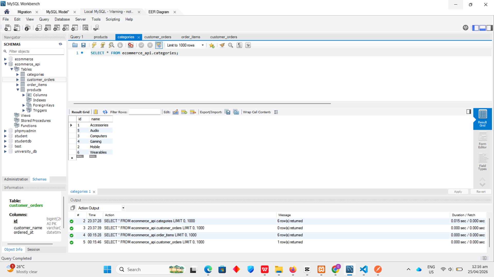
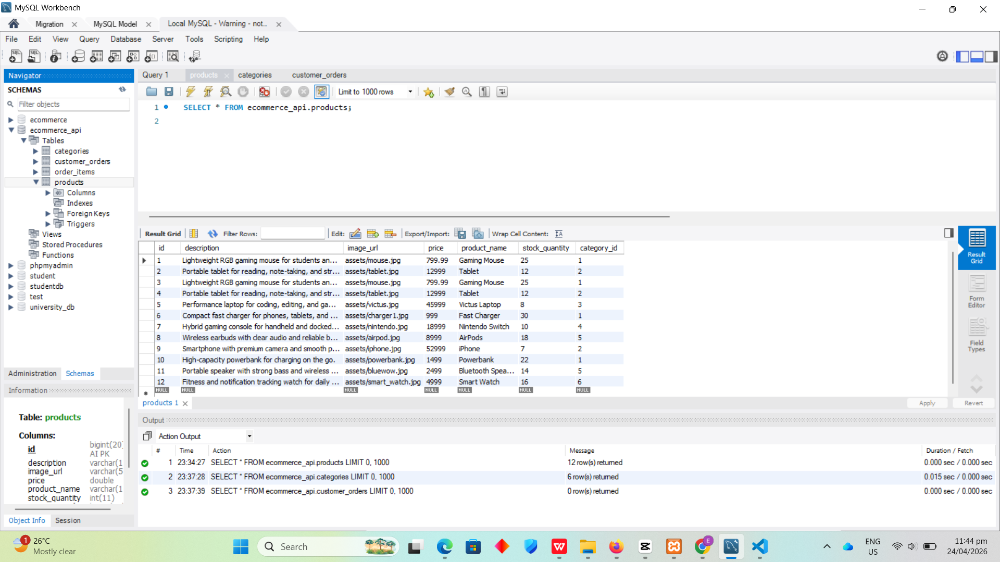
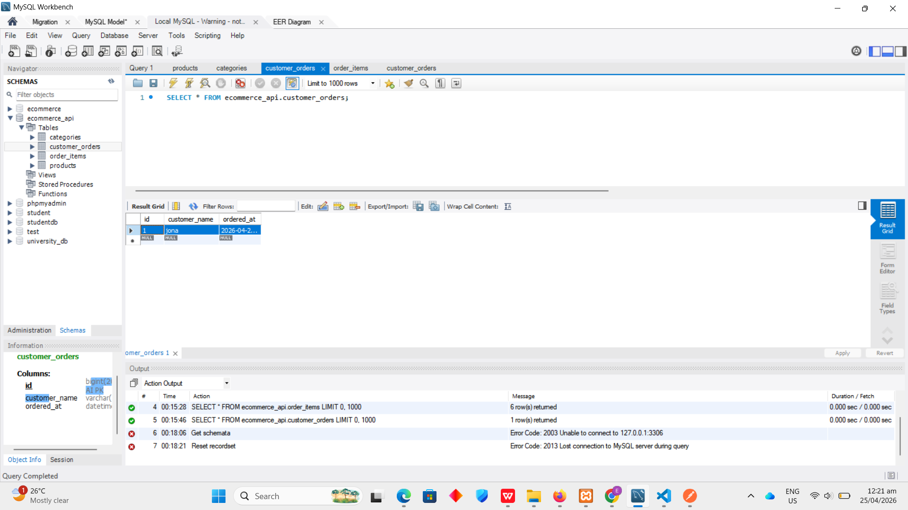
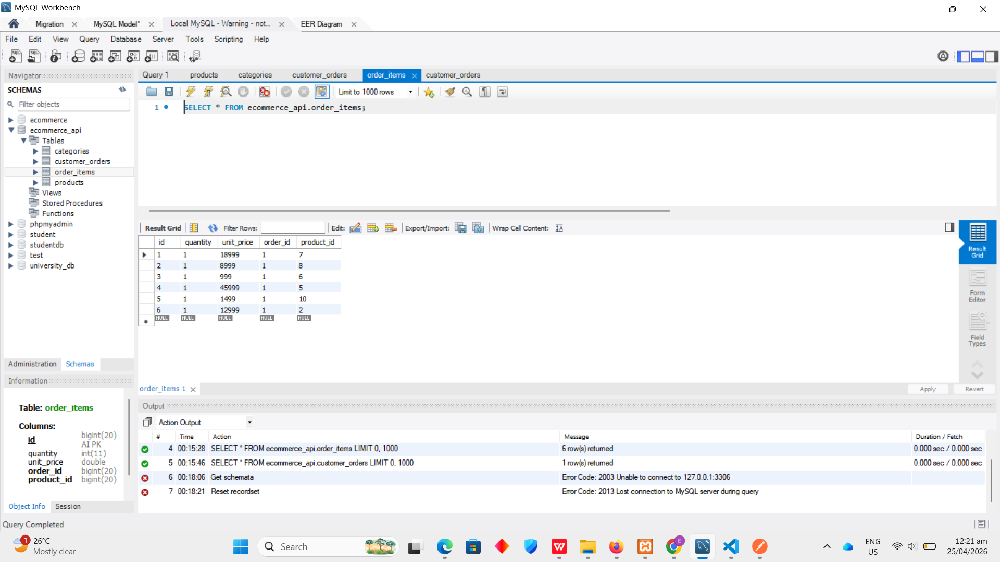
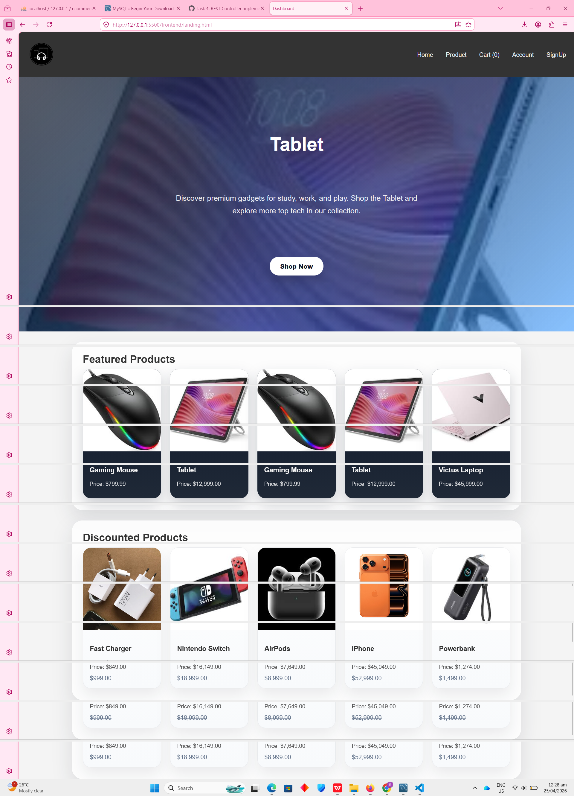
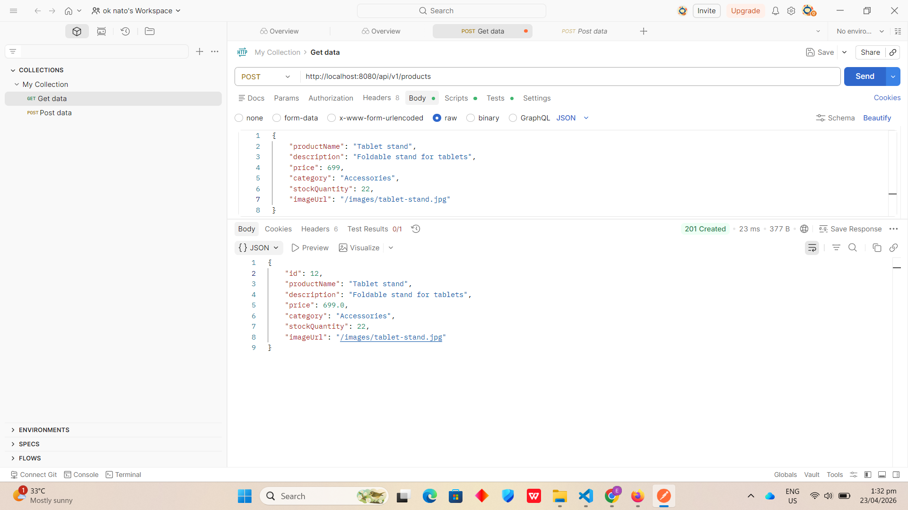

# Ecommerce API

## Project Overview

This project is a Spring Boot REST API for a simple e-commerce product catalog. It provides endpoints to create, read, update, partially update, delete, and filter products. The application is designed for learning basic REST principles, request validation, exception handling, and CRUD operations.

Base URL:

```text
http://localhost:8080/api/v1/products
```

## Tech Stack

- Java
- Spring Boot
- Maven
- Lombok
- Jakarta Validation

## Setup Instructions

### Requirements

- Java 25 installed
- Maven installed, or use the included Maven wrapper

### Run the Application

1. Open a terminal in the project folder:

```powershell
cd "d:\documents\SYSTEMS\WEB SYSTEM\final lab 7\EcommerceApi\EcommerceApi"
```

2. Build the project:

```powershell
.\mvnw.cmd clean install
```

3. Start the application:

```powershell
.\mvnw.cmd spring-boot:run
```

4. Once running, the API will be available at:

```text
http://localhost:8080
```

## Task 3 Repository Pattern Guide

This section explains the beginner-friendly process used to replace manual `ArrayList` logic with Spring Data JPA repositories.

### Goal of Task 3

Instead of storing products in a manual list inside the service class, the application should save, read, update, and delete data through repository interfaces connected to the database.

### Files Used for Task 3

- `src/main/java/com/ws101/EulinMalobago/EcommerceApi/repository/ProductRepository.java`
- `src/main/java/com/ws101/EulinMalobago/EcommerceApi/repository/CategoryRepository.java`
- `src/main/java/com/ws101/EulinMalobago/EcommerceApi/service/ProductService.java`

### Step 1. Create the Repository Package

Create a package named `repository` inside:

```text
src/main/java/com/ws101/EulinMalobago/EcommerceApi/
```

This package is where repository interfaces are stored.

### Step 2. Create `ProductRepository`

Create `ProductRepository.java` inside the `repository` package.

Use this structure:

```java
package com.ws101.EulinMalobago.EcommerceApi.repository;

import java.util.List;

import org.springframework.data.jpa.repository.JpaRepository;
import org.springframework.data.jpa.repository.Query;
import org.springframework.data.repository.query.Param;

import com.ws101.EulinMalobago.EcommerceApi.model.Product;

public interface ProductRepository extends JpaRepository<Product, Long> {
    List<Product> findByProductNameContainingIgnoreCase(String productName);

    List<Product> findByCategory_NameContainingIgnoreCase(String categoryName);

    List<Product> findByPriceLessThanEqual(double price);

    List<Product> findByPriceGreaterThanEqual(double price);

    @Query("SELECT p FROM Product p WHERE p.price BETWEEN :minPrice AND :maxPrice")
    List<Product> findProductsInPriceRange(@Param("minPrice") double minPrice,
                                           @Param("maxPrice") double maxPrice);
}
```

What this does:

- `JpaRepository<Product, Long>` gives built-in CRUD methods
- `findBy...` methods are Spring Data method-name queries
- `@Query` creates a custom JPQL query for price range filtering

### Step 3. Create `CategoryRepository`

Create `CategoryRepository.java` inside the same `repository` package.

Use this structure:

```java
package com.ws101.EulinMalobago.EcommerceApi.repository;

import java.util.Optional;

import org.springframework.data.jpa.repository.JpaRepository;

import com.ws101.EulinMalobago.EcommerceApi.model.Category;

public interface CategoryRepository extends JpaRepository<Category, Long> {
    Optional<Category> findByNameIgnoreCase(String name);
}
```

What this does:

- allows the service layer to find a category by name
- avoids manually searching categories with loops

### Step 4. Refactor `ProductService`

Open:

```text
src/main/java/com/ws101/EulinMalobago/EcommerceApi/service/ProductService.java
```

Replace old `ArrayList` storage logic with repository injection.

Use constructor injection:

```java
private final ProductRepository productRepository;
private final CategoryRepository categoryRepository;
private final Validator validator;

public ProductService(ProductRepository productRepository,
                      CategoryRepository categoryRepository,
                      Validator validator) {
    this.productRepository = productRepository;
    this.categoryRepository = categoryRepository;
    this.validator = validator;
}
```

Then use repository methods inside the service:

```java
productRepository.findAll();
productRepository.findById(id);
productRepository.save(product);
productRepository.delete(product);
```

### Step 5. Remove Old Manual List Logic

The following kinds of code should no longer be used in `ProductService`:

```java
private List<Product> products = new ArrayList<>();
products.add(product);
products.remove(product);
for (Product p : products) { }
```

Why:

- this is manual in-memory storage
- it is not persistent
- it does not use the database

### Step 6. How to Check if Task 3 Is Implemented

Task 3 is complete if:

- `ProductRepository` extends `JpaRepository<Product, Long>`
- `CategoryRepository` extends `JpaRepository<Category, Long>`
- `ProductRepository` has at least one method-name query
- `ProductRepository` has one `@Query` JPQL method
- `ProductService` uses repositories instead of `ArrayList`
- no manual list add, remove, or search logic remains

### Step 7. Current Project Status

Task 3 is already implemented in this project.

Already present:

- `ProductRepository` is created and uses `JpaRepository`
- `CategoryRepository` is created and uses `JpaRepository`
- custom method-name queries are implemented
- JPQL `@Query` for price range is implemented
- `ProductService` uses repository injection and database operations
- manual `ArrayList` manipulation logic has been removed

### Step 8. Do and Don't

Do:

- put query methods inside repository interfaces
- put business logic inside the service layer
- use `findAll`, `findById`, `save`, and `delete`
- use repository methods for filtering

Don't:

- do not store products in `ArrayList`
- do not manually loop through a list to find products
- do not put repository query code inside entity classes
- do not mix old in-memory logic with JPA repository logic

### Step 9. Git Checkpoint

After confirming the code works, save the Task 3 progress with:

```powershell
git add .
git commit -m "Implement repository pattern with Spring Data JPA"
```

### Task 3 Summary

Task 3 was completed by replacing manual in-memory product storage with Spring Data JPA repositories. `ProductRepository` and `CategoryRepository` were created to handle database access using `JpaRepository`. Custom queries were added using both Spring Data method naming and JPQL with `@Query`.

The `ProductService` class was refactored to inject the repositories and use built-in JPA methods such as `findAll()`, `findById()`, `save()`, and `delete()` instead of `ArrayList` operations. This change improved the structure of the project by separating business logic from data access and making the API work with persistent database-backed records.

## Git Branch Guide

### Check Current Branches

```powershell
git branch
```

### Switch to Another Branch

Switch to `master`:

```powershell
git switch master
```

Or switch to any existing branch:

```powershell
git switch branch-name
```

### Create a New Branch

Create and switch to a new branch in one command:

```powershell
git switch -c new-branch-name
```

Example:

```powershell
git switch -c feat/product-api
```

### Delete a Branch

Delete a local branch:

```powershell
git branch -d branch-name
```

Force delete a local branch if needed:

```powershell
git branch -D branch-name
```

Delete a remote branch:

```powershell
git push origin --delete branch-name
```

### Helpful Tip

If Git does not allow switching branches because of uncommitted changes, check your status first:

```powershell
git status
```

## Product Model

Each product contains the following fields:

| Field           | Type      | Notes                          |
|-----------------|-----------|--------------------------------|
| `id`            | `Long`    | Auto-generated                 |
| `productName`   | `String`  | Required, minimum 2 characters |
| `description`   | `String`  | Optional                       |
| `price`         | `double`  | Required, must be positive     |
| `category`      | `String`  | Required                       |
| `stockQuantity` | `int`     | Required, must be 0 or greater |
| `imageUrl`      | `String`  | Optional                       |

## Database Schema

The application now uses a relational database with four main tables:

- `categories` stores reusable product categories such as Accessories, Mobile, and Electronics.
- `products` stores catalog items and includes a `category_id` foreign key pointing to `categories`.
- `customer_orders` stores each placed order with the customer name and order timestamp.
- `order_items` stores the individual line items for each order and links both the parent order and the purchased product.

Relationship summary:

- One category can have many products.
- One product belongs to one category.
- One customer order can have many order items.
- One order item belongs to one customer order.
- Many order items can reference the same product.

### Database Relationship Diagram


### Database Table Screenshots

#### Categories Table



#### Products Table



#### Customer Orders Table



#### Order Items Table



## API Endpoint Reference

| Method | Path | Description | Expected Response |
|---|---|---|---|
| `GET` | `/api/v1/products` | Get all products | `200 OK` with JSON array |
| `GET` | `/api/v1/products/{id}` | Get one product by ID | `200 OK` with product JSON, or `404 Not Found` |
| `GET` | `/api/v1/products/filter?filterType=...&filterValue=...` | Filter products by name, category, price, minPrice, or maxPrice | `200 OK` with JSON array |
| `POST` | `/api/v1/products` | Create a new product | `201 Created` with product JSON |
| `PUT` | `/api/v1/products/{id}` | Replace an existing product | `200 OK` with updated product JSON |
| `PATCH` | `/api/v1/products/{id}` | Partially update selected product fields | `200 OK` with updated product JSON |
| `DELETE` | `/api/v1/products/{id}` | Delete a product by ID | `204 No Content` |

## API Endpoints

These are the database-backed endpoints currently used by the project:

| Method | Path | Description |
|---|---|---|
| `GET` | `/api/v1/products` | Returns all products from the database |
| `GET` | `/api/v1/products/{id}` | Returns one product by ID |
| `GET` | `/api/v1/products/filter?filterType=...&filterValue=...` | Filters products using database queries |
| `POST` | `/api/v1/products` | Creates a new product record |
| `PUT` | `/api/v1/products/{id}` | Replaces an existing product record |
| `PATCH` | `/api/v1/products/{id}` | Partially updates an existing product record |
| `DELETE` | `/api/v1/products/{id}` | Deletes a product record |
| `POST` | `/api/v1/orders` | Creates a customer order with related order items |

### Browser Console Fetch Screenshot

Add your successful browser fetch screenshot to the repository, then embed it here using the same format as the images above.

Example:

```md

```

## Sample Requests and Responses

### 1. Get All Products

Request:

```http
GET /api/v1/products HTTP/1.1
Host: localhost:8080
```

Response:

```json
[
  {
    "id": 1,
    "productName": "Wireless Mouse",
    "description": "Ergonomic wireless mouse with USB receiver.",
    "price": 599.0,
    "category": "Accessories",
    "stockQuantity": 35,
    "imageUrl": "/images/wireless.jpg"
  }
]
```

### 2. Get Product By ID

Request:

```http
GET /api/v1/products/1 HTTP/1.1
Host: localhost:8080
```

Response:

```json
{
  "id": 1,
  "productName": "Wireless Mouse",
  "description": "Ergonomic wireless mouse with USB receiver.",
  "price": 599.0,
  "category": "Accessories",
  "stockQuantity": 35,
  "imageUrl": "/images/wireless.jpg"
}
```

### 3. Create Product

Request:

```http
POST /api/v1/products HTTP/1.1
Host: localhost:8080
Content-Type: application/json
```

```json
{
  "productName": "4k HD Webcam",
  "description": "High-definition webcam with built-in microphone for video calls",
  "price": 1900,
  "category": "Electronics",
  "stockQuantity": 12,
  "imageUrl": "/images/webcam.jpg"
}
```

Response:

```json
{
  "id": 12,
  "productName": "4k HD Webcam",
  "description": "High-definition webcam with built-in microphone for video calls",
  "price": 1900.0,
  "category": "Electronics",
  "stockQuantity": 12,
  "imageUrl": "/images/webcam.jpg"
}
```

### 4. Update Product With PUT

Request:

```http
PUT /api/v1/products/2 HTTP/1.1
Host: localhost:8080
Content-Type: application/json
```

```json
{
  "productName": "Mechanical Keyboard Pro",
  "description": "Compact mechanical keyboard with RGB backlight",
  "price": 2899,
  "category": "Accessories",
  "stockQuantity": 10,
  "imageUrl": "/images/keyboard-pro.jpg"
}
```

Response:

```json
{
  "id": 2,
  "productName": "Mechanical Keyboard Pro",
  "description": "Compact mechanical keyboard with RGB backlight",
  "price": 2899.0,
  "category": "Accessories",
  "stockQuantity": 10,
  "imageUrl": "/images/keyboard-pro.jpg"
}
```

### 5. Partially Update Product With PATCH

Request:

```http
PATCH /api/v1/products/9 HTTP/1.1
Host: localhost:8080
Content-Type: application/json
```

```json
{
  "productName": "4k HD Webcam",
  "price": 1900,
  "stockQuantity": 12,
  "imageUrl": "/images/webcam.jpg"
}
```

Response:

```json
{
  "id": 9,
  "productName": "4k HD Webcam",
  "description": "Fast-charging USB-C wall charger.",
  "price": 1900.0,
  "category": "Mobile",
  "stockQuantity": 12,
  "imageUrl": "/images/webcam.jpg"
}
```

PATCH notes:

- Only the fields included in the request body are updated.
- Supported patch fields are `productName`, `description`, `price`, `category`, `stockQuantity`, and `imageUrl`.
- `id` cannot be changed.

### 6. Delete Product

Request:

```http
DELETE /api/v1/products/3 HTTP/1.1
Host: localhost:8080
```

Response:

```text
204 No Content
```

### 7. Filter Products

Request:

```http
GET /api/v1/products/filter?filterType=category&filterValue=mobile HTTP/1.1
Host: localhost:8080
```

Response:

```json
[
  {
    "id": 5,
    "productName": "Bluewow Phone Cooler",
    "description": "Portable semiconductor phone cooler with RGB lighting, low-noise fan, and adjustable clip.",
    "price": 1299.0,
    "category": "Mobile",
    "stockQuantity": 27,
    "imageUrl": "/images/bluewow.jpg"
  },
  {
    "id": 9,
    "productName": "Phone Charger",
    "description": "Fast-charging USB-C wall charger.",
    "price": 499.0,
    "category": "Mobile",
    "stockQuantity": 50,
    "imageUrl": "/images/charger.jpg"
  }
]
```

## Error Response Examples

### Validation Error

Example request body:

```json
{
  "productName": "",
  "price": -10,
  "category": "",
  "stockQuantity": -1
}
```

Response:

```json
{
  "productName": "Product name is required.",
  "price": "Price must be a positive number.",
  "category": "Category is required.",
  "stockQuantity": "Stock quantity must be non-negative."
}
```

### Product Not Found

Response:

```json
{
  "timestamp": "2026-04-23T10:15:30",
  "status": 404,
  "error": "Not Found",
  "message": "Product not found with ID: 99",
  "path": "/api/v1/products/99"
}
```

## Postman Output Proof

The screenshots below are stored in `src/main/resources/static/postman_output_images` and show the actual Postman results for each implemented HTTP method.

### GET `/api/v1/products`

Shows the full product list returned by the API.


### GET `/api/v1/products/{id}`

Shows one product returned by ID.


### GET `/api/v1/products/filter?filterType=category&filterValue=Accessories`

Shows filtered products based on `filterType` and `filterValue`.


### POST `/api/v1/products`

Shows successful product creation with `201 Created`.



### PUT `/api/v1/products/{id}`

Before update:


After update:


### PATCH `/api/v1/products/{id}`

Before patch:


After patch:


### DELETE `/api/v1/products/{id}`

Before delete:


After delete:


## Known Limitations

- The application depends on a working database configuration.
- Data access now uses Spring Data JPA repositories.
- There is no authentication or authorization.
- This project is intended for development and learning, not production use.
